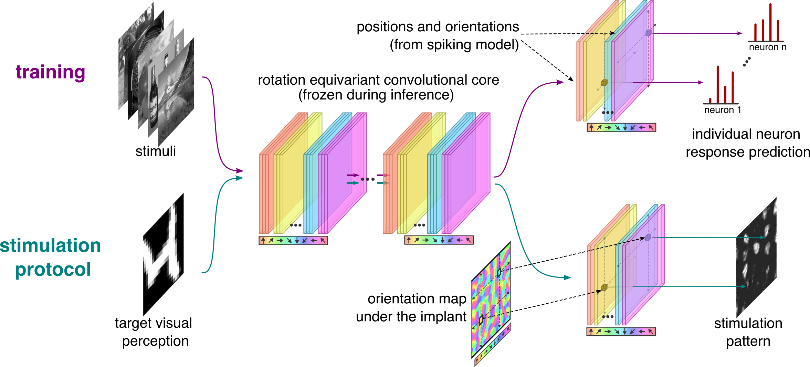

# Beyond retinotopy: exploiting native visual representations in cortical neuroprostheses for vision loss remediation




## Environment setup

```bash
./setup_environment.sh
```

## Code structure

- `LSV1M_training/`: experiments on data from the large scale V1 dataset with the spiking neural network model.
- `monkey_training/`: experiments on monkey data.
- `optogenetic_experiments/`: optogenetic experiments on the LSV1M model.

## Load models

```python
# load model trained on LSV1M dataset
from LSV1M_training.load_best_models import load_model_x
model = load_model_x(neurons_subset='0', return_dataloaders=False)  
```

```python
# load model trained on macaque dataset (need to first download and preprocess data)
from monkey_training.load_best_models import get_best_brcnn_model
model = get_best_brcnn_model(neurons_subset='0', return_dataloaders=False)  
```

## Download and preprocess monkey data
first download the data
```bash
wget --content-disposition      --user-agent="Mozilla/5.0"      https://figshare.com/ndownloader/files/40805201
```
then unzip it
```bash
unzip v1_data.zip
```
finally preprocess it for the dataloaders
```bash
python convert_img_to_npy.py
```